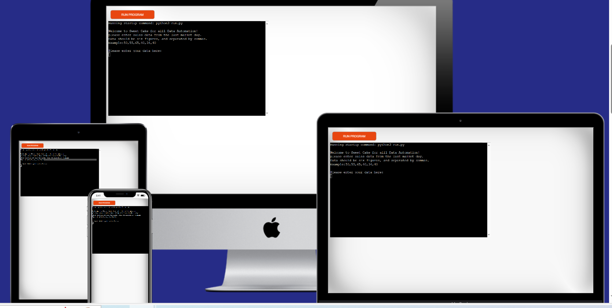
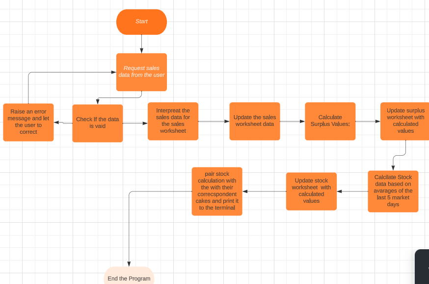
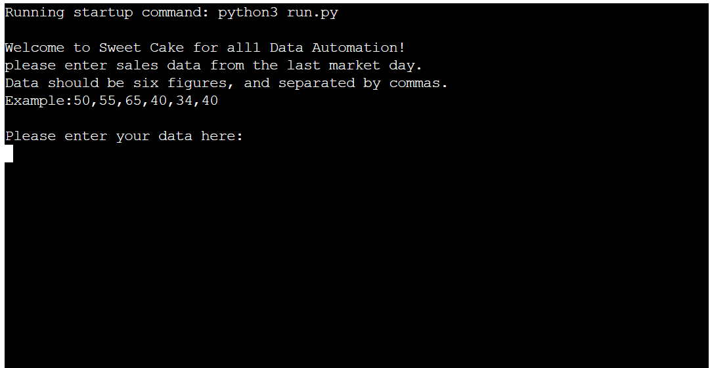
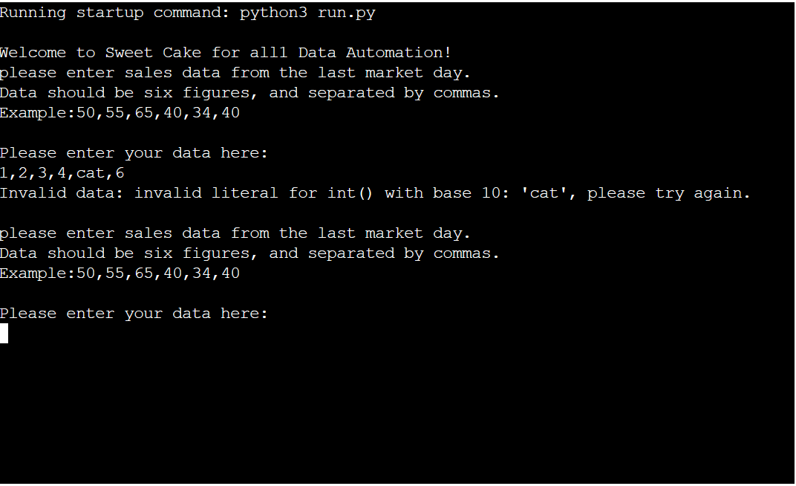
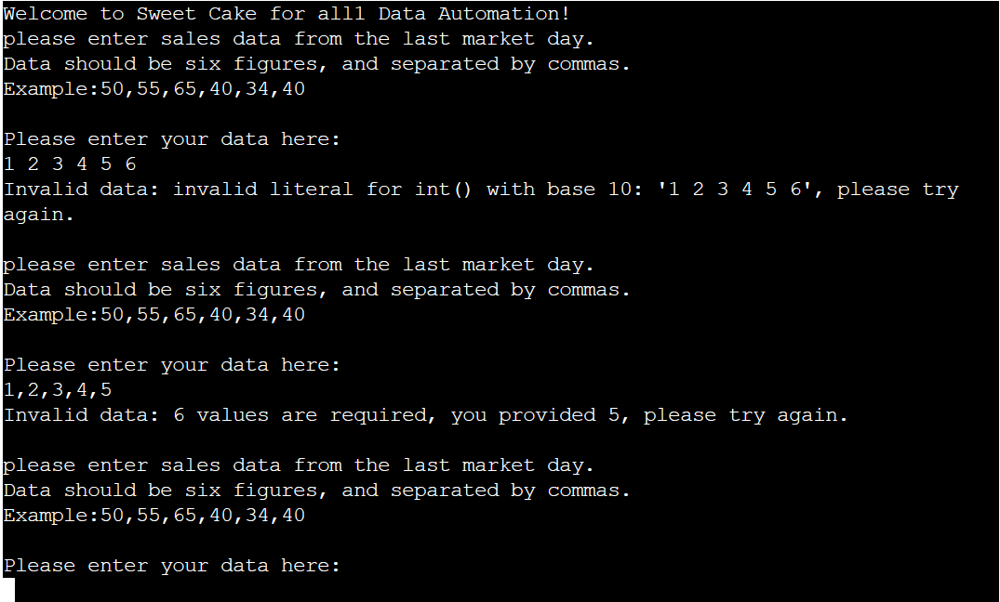
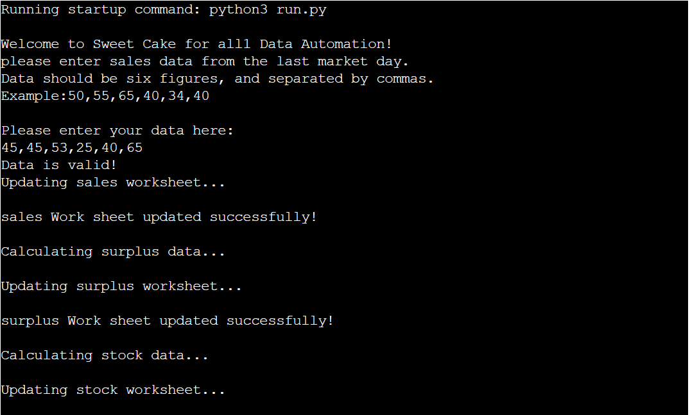
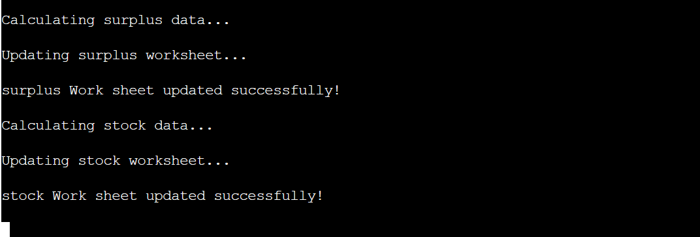
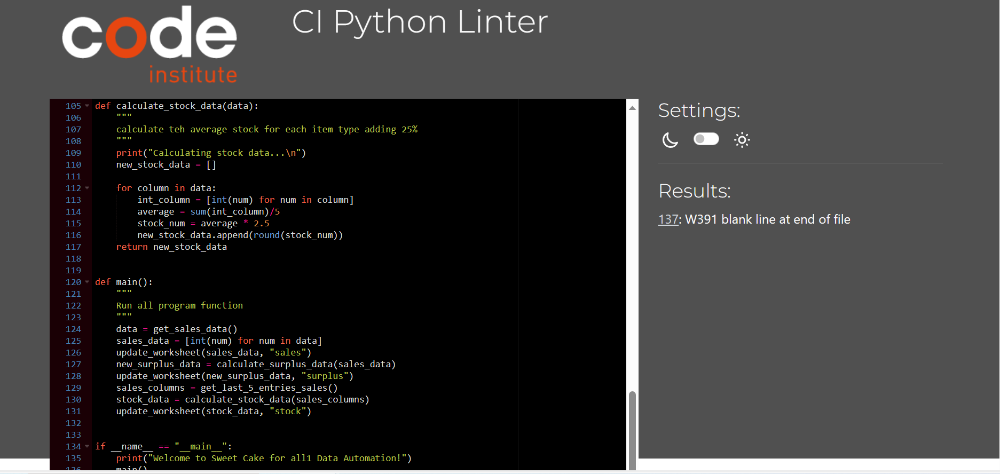

## CONTENTS

* [Sweet Cake For All1](#sweet-cake-for-all1)
* [How To Use](#how-to-use)
* [Technologies Used](#technologies-used)
* [UX](#ux)

  * [Target Audience](#target-audience)
  * [User Stories](#ueser_stories)
* [Features](#features)

  * [Existing Features](#existing-features)
  * [Future Features](#future-features)
* [Testing](#testing)
* [Bugs](#bugs)

  * [Solved Bugs](#solved-bugs)
  * [Unsolved Bugs](#unsolved-bugs)
* [Validator](#validator)
* [Deployment](#deployment)
* [Credits](#credits)
* [Acknowledgment](#achknoweledgment)

## Sweet Cake For All1

 Sweet Cake For All1 is a data Automation program used for the company called  Sweet Cake For All, It will be used to generate a calculated stock data with the intension of a 25% increase for the next market day by collecting the last five sales data from the user, calculate the surplus by subtracting the sales from the stock and the average will be used to calculate the stock.

## How To Use
 

 The user provide sales data from the daily market, this data will be added into asles worksheet and the surplus numbers will be calculated by subtracting the sales from the stock, here the posive number will indicate the cake which is a wastage and the negative number will indicate the additional cake soled for that particular market day with respect to the

## Technologies Used
* [Python](#https://www.python.org/) - is used to develop the data Automation
* [Spreedsheets](#https://tinyurl.com/4ju8jju2) - is used to feed all the data
* [PEP8](#https://pep8ci.herokuapp.com/) - is used to validate the python code
* [Lucidchart](#https://www.lucidchart.com/pages/how-to-make-a-flowchart) - is used to build a flow chart to show how the overall program is running and used
* [Codeanywhere](#https://app.codeanywhere.com/)- is used as a local IDE.
* [Github](#https://github.com/) - used a remote repository.
* [Heroku](#) is used to deploy the project

## UX 
  ### Target Audience
  My data automation software is targeted for the Sweet Cake for all cake company, which aims to collect the daily sales data, to calculate and make a stock prediction for the next market.
  ### User Stories
  * As a user:

    * I would like to know how to feed the daily sales data
    * I would like to know if my datas are valid
    * I would like to know when my input are correctly processed 
    * I would like to have a conformation message if the process went well 

## Features
  ### Existing Features
  Currently the data automation startes with a welcome message, advice the user to enter the daily sales data by providing an example, and if the user input is invalid, it will raise a comment to correct accordegly.

   

  ### Feuture Features
  For the future, a separate soft ware will be provided for the data input and and use another API between the user and data authomation.
## Testing
  ### Manual Testing
  when a user inputs the sales data with a sting, the data automation raise an error Invalid data, and suggestes to inter the correct numerical figure.

  

  when a user input a sales data with out separating it with a comma, the data automation will raise an error, to correct the input.

   

  When the user inputs a sales data with the correct sales data, the data automation will confirm the input is valid and sucessfully update both the sales and surplus worksheet.

  
 
  After sucessfully updating the sales and surplus worksheet the data automation will calcualte the suggested stock for the next market day.

  

 ### Testing Userstories
| UserStorues | Results |
| I would like to know how to feed the daily sales data| when the user open the data automation, the welcoming message with instraction appear|
| I would like to know if my datas are valid| if the user input is valid, the data automation will confirm as Data is Valid |
| I would like to know when my inputs are correctly processed | if the inputes are valid and accepted the data automation will show the worksheet is updated sccessfully and a link to the updated worksheet|
  ### Validation
  * PEP8 validator is used to check the python code is without any error.

  
## Bugs 
 ### Solved Bugs
 * The data input was accepting a negative figure,this issue fixed by putting a forloop in the validate-data function
 ### Remaining Bugs
 * No Bugs   
## Deployment
* steps for deployment

  * Clone sweet cake for all1 repository
  * Create a new Heroku app  
  * Set the buildpacks in the exact order of Python then NodeJs
  * Link the Heroku app to the sweet cake for all1 repository
  * click to deploy
## Credits
* Inspiration of the progect Credits to Code Love Sandwitch Project
### Acknowledgment
1. To my mentor Mr. Rohit for his continuous support
2. For all Code Institute student support team 
